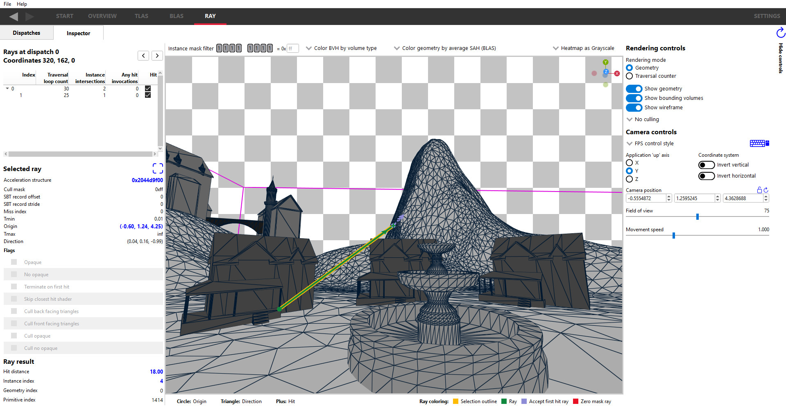

The RAY windows
===============

These panes allow dispatches and rays to be visualized.

The Dispatches Tab
---------------

The main ray dispatches pane allows you to see more information about the selected dispatch,
and select individual dispatch coordinates for further inspection.

The display consists of 2 sections; an information section on the left, and a heatmap image of
the dispatch output on the right.

.. image:: media/ray/ray_history_1.png

The Information section
~~~~~~~~~~~~~~~~~~~~~~~
As well as selecting dispatches from the **Overview pane**, they can also be selected from a dropdown
in the top-left. The UI will be updated according to the dispatch selected.

If a user marker has been associated with a dispatch, it will show up under the dispatch dropdown as
show here:

.. image:: media/ray/ray_user_markers.png

Below the dispatch selection dropdown is the **Dispatch counters** table which shows some high-level
statistics for the selected regions in the heatmap (see below), such as the ray count and number of instance
intersections per ray.

Below this is the **Dispatch coordinates** table. This shows the information for each dispatch
coordinate, including the ray count, the traversal loop count and the number of instance intersections.
The table columns can be sorted to help highlight problematic areas, for example, sorting by Ray count 
to find coordinates that cast too many rays. Note that only the coordinates with at least 1 ray cast
will be displayed.

The Image section
~~~~~~~~~~~~~~~~~~~
On the right hand side is an image visualizing traversal statistics of the dispatch. A typical
image will be a 2D image that correlates closely to the final 2D rendered image in the capture application.
However, applications are free to use 1D, 2D, or 3D dispatches in an arbitrary way that may or may not be
easily mappable to the final rendered image. For 3D dispatches, they can be displayed as a series of 2D
'slices' by changing the **XY image with Z index at** dropdown to change the slice plane displayed, and
index into the slices by editing the number to the right of the dropdown.

The image can visualize each column of the ray table as a heatmap. It can visualize the ray direction as well. 
Ray directions will be mapped from the normalized directions into color space. The coloring mode of the image can be changed by using the dropdown above the viewer. 

A slider bar below the image can be used to adjust the heatmap range, which enables potential problems to be
seen easier. In the case of ray directions, the slider will allow the selection of the ray index for each dispatch coordinate.

The rendered image can be manipulated with the mouse. An area of interest can be selected by holding down
the left mouse button and dragging the mouse. Repeating this process will select a new rectangle. When
a rectangle is selected, the unselected area will be grayed out, and the Ray list will update to filter out
the unselected dispatch coordinates. The right mouse button can be used to cancel or deselect the
selected area. Since some dispatches can be large, the mouse wheel can be used to zoom in or out while the
middle mouse button will pan when the mouse is dragged. The zoom will be focused on the mouse cursor position.

**Zoom controls**

Zoom control buttons are provided to view sections of interest in the heatmap image and are displayed in the top
right, immediately above the heatmap image. These are:

.. |ZoomSelectionRef| image:: media/zoom_to_selection.png
.. |ZoomResetRef| image:: media/zoom_reset.png
.. |ZoomInRef| image:: media/zoom_in.png
.. |ZoomOutRef| image:: media/zoom_out.png

|ZoomSelectionRef| **Zoom to selection**

When **Zoom to selection** is clicked, the zoom level is increased to show the currently selected region.
If there is no selected region, the button will be grayed out and non-functional.

|ZoomResetRef| **Zoom reset**

When **Zoom reset** is clicked, the zoom level is returned to the original default zoom level.

|ZoomInRef| **Zoom in**

Increases the zoom level incrementally to show a smaller area of the image, and duplicates the functionality
accomplished with the mouse wheel. The button will be grayed out and non-functional if at the maximum zoom
level.

|ZoomOutRef| **Zoom out**

Decreases the zoom level incrementally to show a larger area of the image, and duplicates the functionality
accomplished with the mouse wheel. The button will be grayed out and non-functional if at the minimum zoom
level.

Clicking a pixel without dragging will select just that pixel, displaying a cursor icon directly below it.
This dispatch coordinate will be selected in the dispatch coordinates table as well.

An area of interest is shown in the image below:

 .. image:: media/ray/ray_history_2.png

After selecting a region, the dispatch table will be updated to only contain the rays within the dispatch
coordinates of the selected region and the dispatch counters statistics will be updated as well. Double-clicking
on an entry in the table or a pixel in the heatmap image will navigate to the **Ray Inspector** pane.

The Inspector Tab
-----------------

The screen layout is similar to the TLAS and BLAS viewer panes, and is split into 3 areas.

The left section shows a summary of the currently selected dispatch coordinate from the Dispatches tab:
~~~~~~~~~~~~~~~~~~~~~~~~~~~~~~~~~~~~~~~~~~~~~~~~~~~~~~~~~~~~~~~~~~~~~~~~~~~~~~~~~~~~~~~~~~~~~~~~~~~~

.. image:: media/ray/ray_inspector_2.png

In the top-left is the **Ray tree**. The ray index provides the order in which the rays were cast in the
application's shaders; index 0 will be the first ray generated. The rays that are shifted to the right are child rays,
these rays were likely shot/invoked directly from a closest-hit shader which was invoked by the parent ray.

Rays can be chosen by clicking on an entry in the table. The selected ray will be outlined in yellow by default. The ray
colors can be changed in the Themes and colors settings pane.

Underneath this is the Selected ray section showing the values passed to the TraceRay() call in the shader. Clicking on
the box icon to the right of the Selected ray header will focus ray in the 3D view.

The Ray result section shows the distance of the accept hit as well as the instance index, geometry index, and primitive
index of the hit triangle. These fields will be blank if the ray misses.

The center section shows a rendering of the scene:
~~~~~~~~~~~~~~~~~~~~~~~~~~~~~~~~~~~~~~~~~~~~~~~~~~

Super-imposed on the scene are the rays corresponding to the pixel selected from the Ray dispatches pane. The scene
coloring defaults to a new grayscale heatmap coloring mode so that the rays stand out from the background.

Clicking on a ray in the 3D view will select it, as indicated by a yellow (by default) outline around it.
The bottom of the screen shows a legend for the color of the rays, which can be modified in the Themes and colors
settings pane. The TLAS geometry shown cannot be selected in the ray inspector, it's just shown as a visual aid
providing context to the rays.

The instance mask in the top left shows the instance mask of the currently selected ray, and will update the 3D
view to only show instances which are included by the mask. Unlike in the TLAS tab, the instance mask filter is
read-only in the Ray tab. The rays with an instance filter mask of 0 will be colored red (by default) to indicate
that the ray will have no chance of invoking a hit shader.

The right section allows control over the rendering and camera:
~~~~~~~~~~~~~~~~~~~~~~~~~~~~~~~~~~~~~~~~~~~~~~~~~~~~~~~~~~~~~~~

.. image:: media/ray/ray_inspector_4.png

These controls function almost identically to those in the TLAS and BLAS viewer panes.

A notable difference is that this pane contains a lock button to the right of the Camera position label. When locked,
the camera will preserve its position when changing the selected dispatch coordinate in the Dispatches tab instead of
focusing on the first ray in that coordinate's ray list.

